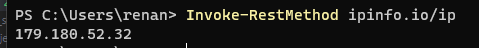

# Meu IP

Curiosamente achar o meu IP nunca pareceu algo simples, a maioria das vezes eu utilizava sites pra informar meu IP e sempre ficava aquela duvida se era o IP certo. Agora aprendi o jeito certo de ver o meu IP:

- Abra o `PowerShell` 
- Digite o comando:
```bash
Invoke-RestMethod ipinfo.io/ip
```

